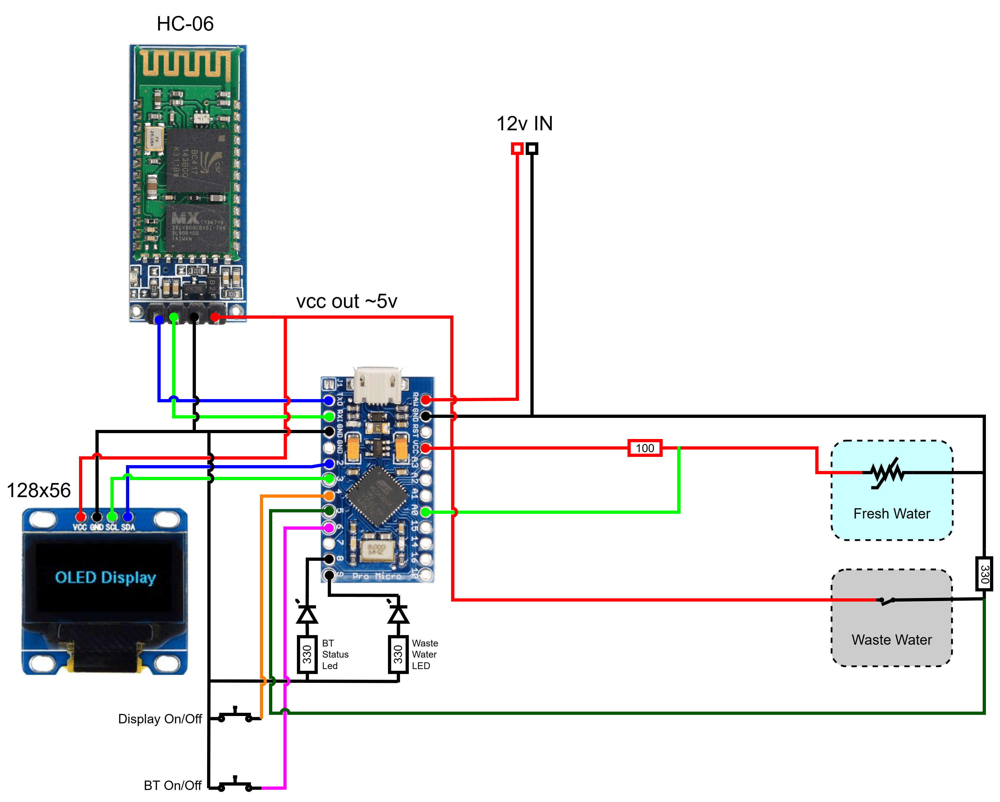

# Arduino Water Gauge

A simple digital gauge to monitor the water level of two tanks.

## Description

The Arduino Water Gauge is a compact and practical solution for monitoring the water levels of two separate tanks: one for fresh water, and one for waste. Using a SparkFun Pro Micro (or any compatible Arduino board), the system reads values from a float sensor to display a linear level for the fresh water tank and a simple full/empty status for the waste water tank via a float switch.

An I2C OLED screen provides real-time feedback, while LED indicators offer quick visual cues, blue for Bluetooth connection status, and red to warn of a full waste tank. Two buttons allow you to switch the Bluetooth module or the display monitor on or off as needed.

With built-in Bluetooth connectivity using an HC-06 module, the data can be remotely accessed for added convenience. Built on PlatformIO but easily portable to the Arduino IDE, this project is ideal for campers, boaters, or anyone managing off-grid water systems.

## Features

* **Dual Tank Monitoring**
  Tracks both fresh water (with linear level) and waste water (with full/empty status).

* **Compact OLED Display**
  128x56 I2C screen provides real-time tank levels at a glance.

* **Bluetooth Connectivity**
  Wireless data access via HC-06 module — great for remote monitoring.

* **Visual Alerts**
  Blue LED for Bluetooth status, red LED warns when the waste tank is full.

* **Display & Bluetooth Control**
  Two push buttons let you easily turn the display or Bluetooth on/off to save power or stay stealthy.

* **Arduino-Compatible**
  Built for SparkFun Pro Micro but works with most Arduino boards.

* **PlatformIO & Arduino IDE Support**
  Developed using PlatformIO, but easy to adapt for use in the Arduino IDE.

* **DIY-Friendly**
  Uses affordable components and a breadboard-friendly design for easy prototyping.

### Hardware

- Sparkfun Pro Micro (or any compatible Arduino Board)
- Bluetooth module HC-06
- I2C Oled Display, 128x56
- 2 x led diode (suggested blue for BT and red for waste water)
- 3 x 330k resistor
- 1 x 100k resistor (depending on sensor range)
- 2 x push button
- jumper wires
- prototyping breadboard
- Float switch
- Fuel/Water floating sensor

### Software

The project is built with Platformio (https://platformio.org/)
If you are using the Arduino IDE, just copy the main.cpp file, rename it as .ino and import the required libraries.

### Schematics

| HC-06 | Arduino |
| :---- | :------ |
| `Rx`  | `Tx`    |
| `Tx`  | `Rx`    |
| `Vcc` | `Vcc`   |
| `Gnd` | `Gnd`   |

| I2C Oled  | Arduino (Sparkfun Pro Micro) |
| :-------- | :--------------------------- |
| `Sck`     | `3 (Scl)`                    |
| `Sda`     | `2 (Sda)`                    |
| `Vcc/Vdd` | `Vcc`                        |
| `Gnd`     | `Gnd`                        |

### Pro Micro pinout reference

